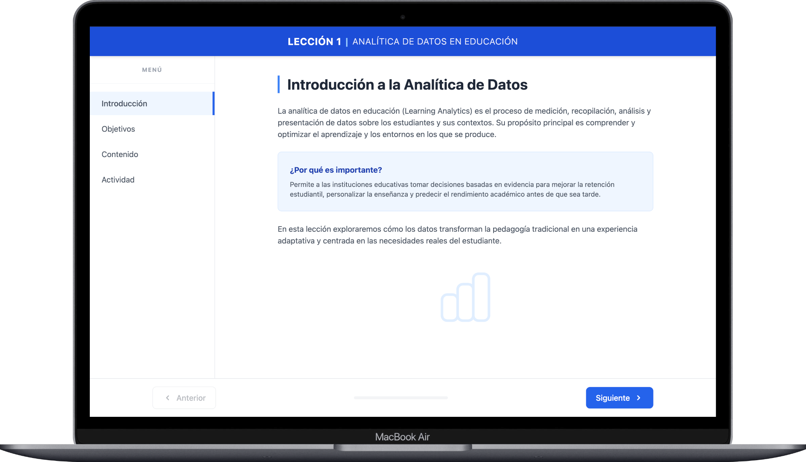
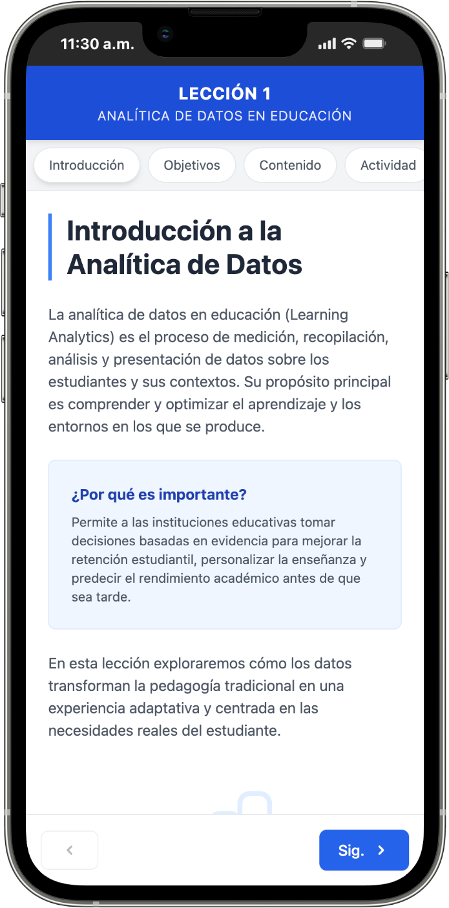

# OVAs - Prueba técnica

Este proyecto es una aplicación web desarrollada en **Angular** que simula un **Objeto Virtual de Aprendizaje (OVAs)**.  
La aplicación guía al usuario a través de una lección interactiva sobre **“Analítica de Datos en Educación”**, incluyendo:

- Navegación secuencial entre secciones.
- Componentes reutilizables.
- Una actividad de evaluación tipo selección múltiple.

---

## 🛠️ Tecnologías Utilizadas

- **Framework:** Angular 16+
- **Lenguaje:** TypeScript
- **Estilos:** Tailwind CSS (diseño responsivo y utilitario)
- **Enrutamiento:** Angular Router

---

## 📋 Requisitos Previos

Para ejecutar este proyecto, necesitas tener instalado:

- **Node.js:** v16.x o superior  
- **Angular CLI:** v16.x o superior  
  ```bash
  npm install -g @angular/cli
  ```

---

## 🚀 Instrucciones de Instalación y Ejecución

Sigue estos pasos para visualizar el proyecto en tu entorno local:

1. **Clonar el repositorio:**
   ```bash
   git clone <URL_DE_TU_REPOSITORIO>
   cd <NOMBRE_DE_LA_CARPETA>
   ```

2. **Instalar dependencias:**
   ```bash
   npm install
   ```

3. **Ejecutar el servidor de desarrollo:**
   ```bash
   ng serve
   ```

4. **Abrir en el navegador:**
   Navega a [http://localhost:4200/](http://localhost:4200/). La aplicación se recargará automáticamente si cambias algún archivo fuente.

---

## 💡 Decisiones Técnicas

A continuación, describo las decisiones clave tomadas durante el desarrollo para cumplir con los requerimientos de escalabilidad y mantenimiento:

### 1. Arquitectura de Navegación (Routing + Service)
- Se optó por utilizar **Angular Router** en lugar de un renderizado condicional simple (`*ngIf`).
  - **¿Por qué?** Permite que cada sección de la lección tenga su propia URL única, lo cual es estándar en la web y facilita compartir enlaces específicos.
- **LessonService:** Se implementó un servicio dedicado para centralizar la lógica de "Siguiente/Anterior". Este servicio escucha los eventos del router y calcula automáticamente si los botones de navegación deben estar habilitados o deshabilitados, desacoplando esta lógica de los componentes visuales.

### 2. Diseño con Tailwind CSS
- Se eligió **Tailwind CSS** para la maquetación.
  - **¿Por qué?** Permite un desarrollo rápido de interfaces responsivas sin necesidad de escribir archivos CSS personalizados extensos. Facilita el mantenimiento de la coherencia visual (colores, espaciados) y asegura que la aplicación se adapte fluidamente a dispositivos móviles (Mobile First).

### 3. Componentes Reutilizables
- **MultipleChoiceQuestionComponent:** El componente de la actividad se diseñó para ser agnóstico al contenido. Recibe la pregunta, las opciones y la respuesta correcta mediante `@Input()`, lo que permite reutilizarlo para cualquier número de preguntas futuras sin modificar su código interno.
- **Header Dinámico:** El componente Header recibe el título de la lección como propiedad, permitiendo su reutilización en diferentes contextos o lecciones.

---

## 📂 Estructura del Proyecto

```plaintext
src/app/
├── services/       # Lógica de negocio (LessonService)
├── layout/              # Componentes estructurales (Header, Sidebar, Footer)
├── pages/               # Vistas principales (Introducción, Objetivos, etc.)
├── components/     # Componentes UI reutilizables (Pregunta Selección Múltiple)
└── app-routing.module.ts # Configuración de rutas
```

---

## 📸 Previsualización de la Aplicación
Link para previsualizar la aplicación: https://ovas-app.vercel.app/introduccion

### Vista en escritorio


### Vista en Dispositivos Móviles


---

Desarrollado por **Urbano Calderón**.
